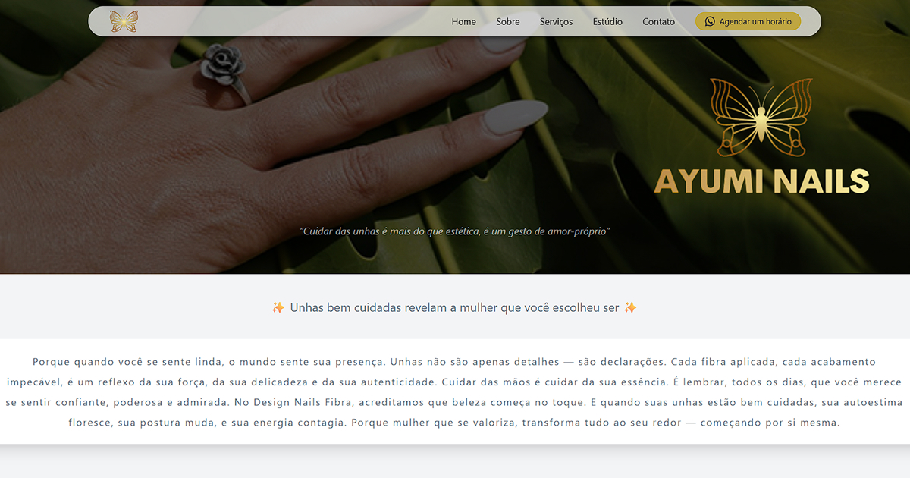

# 💅 AyumiFer - Landing Page

Landing Page desenvolvida para a profissional **AyumiFer**, especialista em design de unhas e alongamento em fibra.  
O projeto foi pensado para transmitir **elegância, conforto visual e modernidade**, refletindo a identidade da marca.

---

## 🚀 Tecnologias Utilizadas

- **Next.js** – Framework React para SSR e performance otimizada.  
- **TypeScript** – Tipagem estática para maior segurança e escalabilidade.  
- **Tailwind CSS** – Estilização rápida, responsiva e altamente customizável.  
- **shadcn/ui** – Componentes pré-estilizados que garantem consistência e sofisticação.  
- **Figma** – Protótipos de design e identidade visual.  

---

## 🎨 Design e Responsividade

- Layout **100% responsivo**, adaptado para dispositivos móveis, tablets e desktops.  
- Interface com foco em **conforto visual e elegância**.  
- Paleta de cores inspirada na identidade da profissional, transmitindo delicadeza e confiança.  

---

## 🌟 Funcionalidades

- **Página Home** com Hero dinâmico exibindo a data atual
- **Menu de navegação** com seções:
  - Home
  - Estúdio
  - Serviços
  - Contato
  - Sobre
- **Links diretos para redes sociais**
- **Design totalmente responsivo**, adaptado para dispositivos móveis, tablets e desktops
- **Experiência visual confortável e elegante** para clientes do estúdio

---
